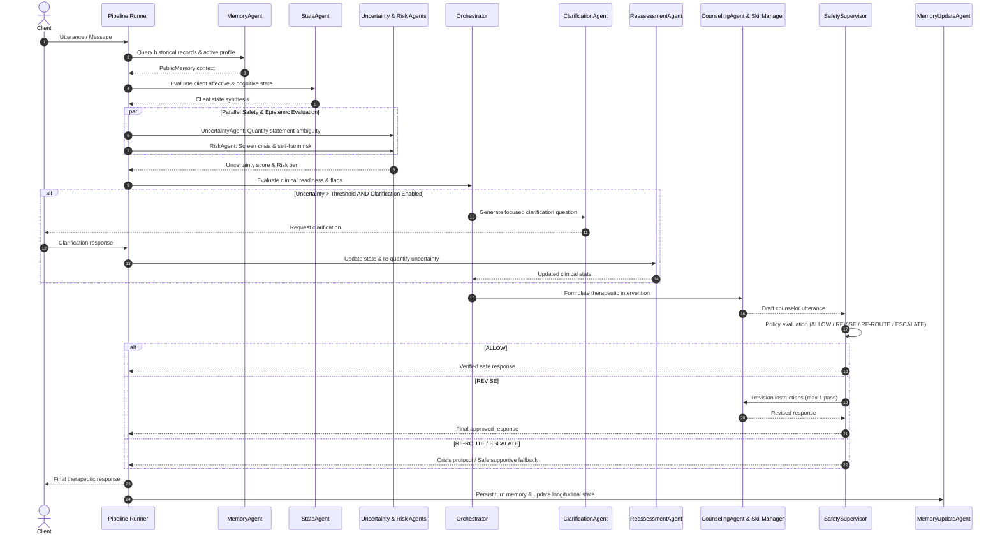

# Agentic AI for Mental Health

> **A Multi-Agent System with Uncertainty Quantification, Risk-Gated Clarification, and Real-Time Safety Supervision for Longitudinal Psychotherapy**
>
> *Academic Institute Project — Indian Institute of Information Technology Guwahati (IIIT Guwahati)*  
> *Repository:* [https://github.com/Ganesh-123-maker/AgenticAI-Mental-Health](https://github.com/Ganesh-123-maker/AgenticAI-Mental-Health)

---

## Abstract & Overview

Conversational artificial intelligence in mental health contexts faces critical challenges: premature therapeutic interventions based on ambiguous client statements, insufficient risk detection during acute crises, lack of safety boundaries, and an inability to maintain structured longitudinal therapeutic context across multiple sessions.

**Agentic AI for Mental Health** addresses these limitations by introducing a decoupled, multi-agent architecture. Rather than relying on a single monolithic language model to simultaneously assess, counsel, and monitor safety, this platform divides responsibilities across specialized collaborating agents. The system quantifies client statement uncertainty, conducts parallel risk screening, dynamically solicits clarifications when epistemic ambiguity is high, routes discourse according to clinical readiness, executes multi-school psychotherapy interventions, and enforces safety boundaries via an independent real-time safety supervisor.

```
+---------------------------------------------------------------------------------------------------------+
|                                    Agentic AI Mental Health Architecture                                 |
+---------------------------------------------------------------------------------------------------------+
|  [Client Input]                                                                                         |
|        |                                                                                                |
|        v                                                                                                |
|  [MemoryAgent] ------------> Retrieves public memory, longitudinal trajectory, and active session goals |
|        |                                                                                                |
|        v                                                                                                |
|  [StateAgent] -------------> Evaluates affective valence, cognitive patterns, and discourse coherence   |
|        |                                                                                                |
|        +-----------------------------------+-----------------------------------+                        |
|        |                                   |                                   |                        |
|        v                                   v                                   v                        |
|  [UncertaintyAgent]                  [RiskAgent]                         (Parallel Analysis)            |
|  Quantifies epistemic ambiguity      Multi-tier crisis screening                                        |
|        |                                   |                                                            |
|        +-----------------------------------+                                                            |
|        |                                                                                                |
|        v                                                                                                |
|  [Orchestrator] <----------------------------------------------------------+                            |
|        |                                                                   |                            |
|        +-----> [High Uncertainty] ---> [ClarificationAgent]                |                            |
|        |                                      |                            |                            |
|        |                                      v                            |                            |
|        |                               [Client Reply]                      |                            |
|        |                                      |                            |                            |
|        |                                      v                            |                            |
|        |                               [ReassessmentAgent] ----------------+                            |
|        |                                                                                                |
|        +-----> [Clinical Intervention Ready]                                                            |
|                       |                                                                                 |
|                       v                                                                                 |
|               [CounselingAgent] <----> [SkillManager / RAG] (CBT, BT, HET, PDT, PMT)                    |
|                       |                                                                                 |
|                       v                                                                                 |
|               [SafetySupervisor] ----> Policy Check: [ALLOW | REVISE | RE-ROUTE | ESCALATE]             |
|                       |                                                                                 |
|                       v                                                                                 |
|               [Response to Client]                                                                      |
|                       |                                                                                 |
|                       v                                                                                 |
|               [MemoryUpdateAgent] & [OutcomeAgent] ---> Updates longitudinal state and evaluates session|
+---------------------------------------------------------------------------------------------------------+
```

---

## Core System Architecture

The system implements 11 specialized agent modules located in `src/sample/agents/`:

| Agent Class | Source File | Primary Responsibility |
|:---|:---|:---|
| `MemoryAgent` | `src/sample/agents/memory_agent.py` | Retrieves multi-session historical context, structured public memory (`PublicMemory`), past clinical impressions, and longitudinal treatment trajectory. |
| `StateAgent` | `src/sample/agents/state_agent.py` | Synthesizes current client presentation, extracting psychological states, emotional valence, and interaction dynamics from recent discourse. |
| `UncertaintyAgent` | `src/sample/agents/uncertainty_agent.py` | Computes uncertainty metrics across client disclosures, identifying ambiguous symptoms, missing timelines, or conflicting clinical narratives. |
| `RiskAgent` | `src/sample/agents/risk_agent.py` | Evaluates self-harm, suicidal ideation, crisis severity, and interpersonal violence risks through a dedicated multi-tiered screening rubric. |
| `ClarificationAgent` | `src/sample/agents/clarification_agent.py` | Generates targeted, non-intrusive clinical clarification queries when uncertainty exceeds calibrated thresholds before any intervention is attempted. |
| `ReassessmentAgent` | `src/sample/agents/reassessment_agent.py` | Re-evaluates client state, uncertainty scores, and risk classifications following client clarification responses. |
| `Orchestrator` | `src/sample/agents/orchestrator.py` | Dynamically controls pipeline execution, routing control flow to clarification loops, direct counseling, or risk-mitigation pathways. |
| `CounselingAgent` | `src/sample/agents/counseling_agent.py` | Formulates evidence-based therapeutic responses using retrieved clinical micro-skills tailored to the active psychotherapy modality. |
| `SafetySupervisor` | `src/sample/agents/safety_supervisor.py` | Operates as an independent real-time safety gatekeeper, validating every proposed counselor utterance under four strict actions (`ALLOW`, `REVISE`, `RE-ROUTE`, `ESCALATE`). |
| `OutcomeAgent` | `src/sample/agents/outcome_agent.py` | Evaluates immediate session outcomes, therapeutic alliance progression, and emotional trajectory post-turn. |
| `MemoryUpdateAgent` | `src/sample/agents/memory_update_agent.py` | Extracts key clinical updates, updates longitudinal records, and maintains persistent state across therapy visits. |

---

## End-to-End Execution Pipeline

The multi-agent pipeline is coordinated by `run_pipeline` in `src/sample/agents/pipeline.py`. It follows a structured, safety-gated execution flow:



### Safety Supervisor Decision Policies
The `SafetySupervisor` acts as a firewall between generation and client delivery:
- **`ALLOW`**: The response conforms to clinical ethics, contains no medical diagnosis claims, respects boundaries, and addresses client state appropriately.
- **`REVISE`**: The response contains minor boundary overreaches, overly directive advice, or ungrounded assumptions. A targeted revision request is sent back to the counseling agent (capped at 1 revision).
- **`RE-ROUTE`**: The response failed to address an emerging clinical risk. Control is returned to the orchestrator for route adjustment (capped at 1 re-route).
- **`ESCALATE`**: Crisis or acute self-harm indicators require immediate crisis protocol engagement, triggering standardized emergency helpline information and supportive de-escalation without hallucinated medical guidance.

---

## Psychotherapy Modalities Supported

The counseling module supports five evidence-based psychotherapeutic orientations via structured domain configurations in `prompts/psychagent/` and micro-skill retrieval in `assets/skills/sect/`:

1. **Cognitive Behavioral Therapy (CBT)**
   - Core Mechanisms: Identification of cognitive distortions, thought challenging, behavioral activation, cognitive restructuring.
2. **Behavioral Therapy (BT)**
   - Core Mechanisms: Stimulus control, exposure hierarchies, reinforcement contingencies, behavioral modification protocols.
3. **Humanistic / Emotion-Focused Therapy (HET)**
   - Core Mechanisms: Unconditional positive regard, empathic attunement, emotion validation, experiential reflection.
4. **Psychodynamic Therapy (PDT)**
   - Core Mechanisms: Exploration of recurring relational patterns, defense mechanisms, emotional ambivalence, unconscious conflict articulation.
5. **Parent Management Training / Psychiatric Management (PMT)**
   - Core Mechanisms: Structured behavioral contingencies, praise-to-correction ratios, consistency frameworks, clear boundary enforcement.

---

## Evaluation Framework

The platform includes a comprehensive, two-layer clinical and agentic evaluation suite:

### Layer 1: Clinical & Psychometric Instruments
Located in `src/eval/methods/`:

- **Client Psychological State Assessments (`src/eval/methods/client/`)**:
  - `PHQ-9`: Patient Health Questionnaire for depression severity assessment
  - `BDI-II`: Beck Depression Inventory-II
  - `STAI`: State-Trait Anxiety Inventory
  - `PANAS`: Positive and Negative Affect Schedule (scoring positive and negative affect scales)
  - `SCL-90`: Symptom Checklist-90
  - `SRS`: Session Rating Scale for working alliance and relational perception
  - `CCT`, `SFBT`, `IPO`: Core conflictual relationship theme, solution-focused, and inventory of personality organization metrics
- **Counselor Competency & Process Metrics (`src/eval/methods/counselor/`)**:
  - `WAI`: Working Alliance Inventory (Goal, Task, and Bond dimensions)
  - `CTRS`: Cognitive Therapy Rating Scale
  - `TES` & `MITI`: Therapeutic Empathy Scale and Motivational Interviewing Treatment Integrity
  - `PSC` & `EFT-TFS`: Problem-Solving Competency and Emotion-Focused Task Facilitation
  - `Dialogue Grounding`, `Planning`, & `Redundancy`: Algorithmic evaluation of conversation grounding, clinical planning adherence, and utterance redundancy
  - `HTAIS`: Human-Technology Therapeutic Alliance Interaction Scale

### Layer 2: Multi-Agent Coordination Metrics
Located in `src/eval/methods/multi_agent/`:

- **`coordination.py`**: Quantifies agent routing fidelity, handoff efficiency, and pipeline coherence.
- **`uncertainty.py`**: Evaluates epistemic uncertainty calibration and clarification trigger accuracy.
- **`safety.py`**: Measures safety supervisor intervention precision, revision efficacy, and zero-leakage crisis policy compliance.
- **`longitudinal.py`**: Tracks multi-session memory retention, goal continuity, and avoidance of repetitive questioning.

---

## Experimental Benchmark & Ablation Studies

The benchmark suite in `src/experiments/` evaluates systems against ambiguous clinical scenarios (`data/benchmark/ambiguous_cases/`):

### Compared System Configurations

| Configuration | Multi-Agent | Skill RAG | Memory | Multi-Session | Description |
|:---|:---:|:---:|:---:|:---:|:---|
| **System A** | No | No | No | No | Monolithic Vanilla LLM baseline |
| **System B** | No | Yes | Yes | No | Modular Baseline with skill retrieval and memory |
| **System C** | Yes | Yes | Yes | No | Multi-Agent with Uncertainty Quantification active |
| **System D** | Yes | Yes | Yes | No | Multi-Agent with Risk Screening & Clarification loop |
| **System E** | Yes | Yes | Yes | No | Safety-Supervised System with real-time SafetySupervisor |
| **System F** | Yes | Yes | Yes | Yes | Full PsychAgent with longitudinal multi-session state |

### Systematic Ablation Studies
The experiment runner (`src/experiments/run_systems.py`) supports targeted ablation toggles:
- `ablation_no_uncertainty`: Disables epistemic uncertainty scoring
- `ablation_no_risk`: Disables dedicated risk assessment agent
- `ablation_no_clarification`: Bypasses clarification solicitation on ambiguous input
- `ablation_no_safety_supervisor`: Removes the real-time safety inspection gate
- `ablation_no_longitudinal`: Strips historical session context between visits
- `ablation_no_multi_agent_routing`: Replaces dynamic agent orchestration with fixed sequence

---

## Full-Stack Web Application

The platform includes a complete web application enabling clinicians and researchers to interact with the multi-agent system:

```
src/web/
├── backend/                  # FastAPI Application
│   ├── routes/
│   │   ├── courses.py        # Multi-session therapy course endpoints
│   │   └── visits.py         # Real-time consultation visit endpoints
│   ├── domain.py             # Psychotherapy schools and stages definitions
│   ├── models.py             # SQLModel data models (User, Course, Visit, Record)
│   └── psychagent_engine.py  # Bridge between FastAPI and multi-agent pipeline
├── src/                      # Frontend Application (React 18 + Vite 5)
│   ├── components/           # UI components (Chat, CourseCard, SchoolSelector)
│   ├── pages/                # Views (Dashboard, SessionView, AssessmentView)
│   ├── services/             # API client services
│   └── App.jsx               # Main React entrypoint
└── main.py                   # FastAPI server entrypoint
```

---

## Repository Structure

```
.
├── assets/
│   └── skills/               # Psychotherapy micro-skill knowledge base
│       └── sect/             # Structured clinical intervention skills
├── configs/
│   ├── baselines/            # Baseline model configurations
│   ├── prompts/              # Model prompt configurations
│   └── runtime/              # Active runtime and server parameters
├── data/
│   └── benchmark/
│       └── ambiguous_cases/  # Multi-school ambiguous client case benchmark
├── prompts/
│   └── psychagent/           # System prompts for all 11 agents across modalities
├── src/
│   ├── eval/                 # Evaluation framework (Client, Counselor, Multi-Agent)
│   ├── experiments/          # Benchmark and ablation experiment runners
│   ├── sample/
│   │   ├── agents/           # The 11 core multi-agent implementations & pipeline
│   │   ├── core/             # Data schemas (PublicMemory, SessionContext)
│   │   ├── backends/         # LLM backend interfaces (SGLang, OpenAI, Local)
│   │   ├── runner.py         # Pipeline execution coordinator
│   │   └── skill_manager.py  # Embedding-based clinical micro-skill retriever
│   └── web/                  # Full-stack web application (React + FastAPI)
└── tests/
    ├── agents/               # Multi-agent unit and integration test suites
    └── eval/                 # Evaluation metrics verification tests
```

---

## Installation & Setup

### Prerequisites
- **Python**: Version 3.10 or higher
- **Node.js**: Version 18.0 or higher (for the web frontend)
- **Git**

### 1. Clone the Repository
```bash
git clone https://github.com/Ganesh-123-maker/AgenticAI-Mental-Health.git
cd AgenticAI-Mental-Health
```

### 2. Python Environment Setup
```bash
python -m venv venv

# On Linux/macOS:
source venv/bin/activate

# On Windows (PowerShell):
.\venv\Scripts\Activate.ps1

# Install core dependencies
pip install -r requirements.txt
```

### 3. Environment Variables Configuration
Create a `.env` file in the project root:

```env
# Primary LLM Backend Configuration
OPENAI_API_KEY=your_openai_api_key_here
CHAT_API_KEY=your_chat_api_key_here
CHAT_API_BASE=https://api.openai.com/v1

# Embedding API Configuration (for SkillManager RAG retrieval)
PSYCHAGENT_EMBEDDING_API_KEY=your_embedding_api_key_here

# SGLang Backend (Optional, if using local SGLang inference engine)
SGLANG_API_KEY=your_sglang_key_here

# Server Configuration
BACKEND_HOST=0.0.0.0
BACKEND_PORT=8000
FRONTEND_PORT=5173
```

---

## Running the Platform

### Running the Test Suite
Execute the agent pipeline and evaluation tests:
```bash
# Run all agent unit and integration tests
pytest tests/agents/ -v

# Run evaluation framework tests
pytest tests/eval/ -v

# Run standalone multi-agent pipeline validation
pytest tests/agents/test_agents_standalone.py -v
```

### Running the End-to-End Demonstration Scenario
To verify the full 11-phase runtime pipeline (including multi-session continuity, longitudinal memory, ambiguity clarification, contradiction handling, crisis escalation, and multi-user isolation):
```bash
# Execute the comprehensive 11-phase integration verification
python scratch/test_demo_flow.py
```

### Running Experiments & Ablation Benchmarks
To run the automated benchmark across system configurations:
```bash
# Execute evaluation on ambiguous cases
python -m src.experiments.run_systems --benchmark-dir data/benchmark/ambiguous_cases --system System_F

# Run failure analysis
python -m src.experiments.failure_analysis
```

### Launching the Web Application

#### Start the Backend Server (FastAPI)
```bash
# Launch FastAPI backend service on port 8000
python -m uvicorn src.web.main:app --host 0.0.0.0 --port 8000 --reload
```
The interactive API documentation is available at `http://localhost:8000/docs`.

#### Start the Frontend Interface (React + Vite)
```bash
# Navigate to web application directory
cd src/web

# Install frontend dependencies
npm install

# Start Vite development server
npm run dev
```
Open your browser and navigate to `http://localhost:5173`.

---

## Research Ethics & Clinical Disclaimers

> [!CAUTION]
> **RESEARCH PROTOTYPE ONLY — NOT FOR MEDICAL USE**
>
> 1. **Non-Clinical Software**: This software is an academic research prototype developed as an Institute Project at IIIT Guwahati. It is **not** a licensed medical device, clinical diagnostic tool, or substitute for professional medical, psychiatric, or psychological counseling.
> 2. **No Medical Advice**: The system does not provide medical diagnoses, prescribe medications, or replace human clinical judgment.
> 3. **Emergency Disclaimers**: If you or someone you know is experiencing acute emotional distress, self-harm impulses, or a mental health crisis, please contact qualified emergency services immediately:
>    - **India**: Tele-MANAS (`14416` or `1800-891-4416`) | KIRAN Mental Health Helpline (`1800-599-0019`) | National Emergency (`112`)
>    - **United States & Canada**: Suicide & Crisis Lifeline (`988`) | Emergency (`911`)
>    - **United Kingdom**: NHS Mental Health Services (`111`) | Emergency (`999`)
>    - **International**: Find immediate resources at [Befrienders Worldwide](https://www.befrienders.org/) or [findahelpline.com](https://findahelpline.com/)

---

## Academic Citation & Attribution

This repository is maintained as an academic research project at the Indian Institute of Information Technology Guwahati (IIIT Guwahati). It builds upon foundational multi-agent psychotherapy research:

```bibtex
@misc{agentic_ai_mental_health_2026,
  author       = {Ganesh and Contributors},
  title        = {Agentic AI for Mental Health: A Multi-Agent System with Uncertainty Quantification, Risk-Gated Clarification, and Real-Time Safety Supervision},
  year         = {2026},
  howpublished = {\url{https://github.com/Ganesh-123-maker/AgenticAI-Mental-Health}},
  institution  = {Indian Institute of Information Technology Guwahati}
}

@article{zheng2024psychagent,
  author       = {Zheng, et al.},
  title        = {PsychAgent: A Multi-Agent Framework for Dynamic Psychological Counseling via Modular Clinical Expertise},
  journal      = {arXiv preprint},
  year         = {2024}
}
```

---

## License

This project is distributed under the terms of the MIT License. See [LICENSE](LICENSE) for details.
