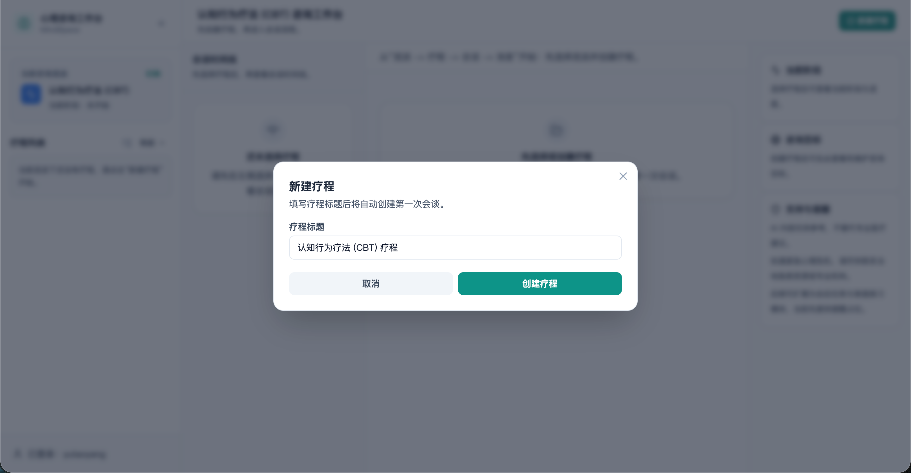
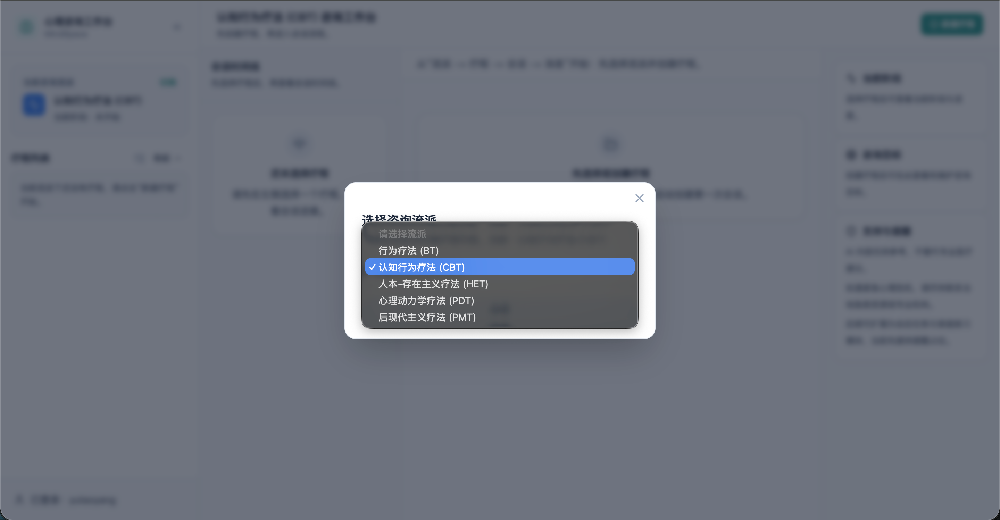
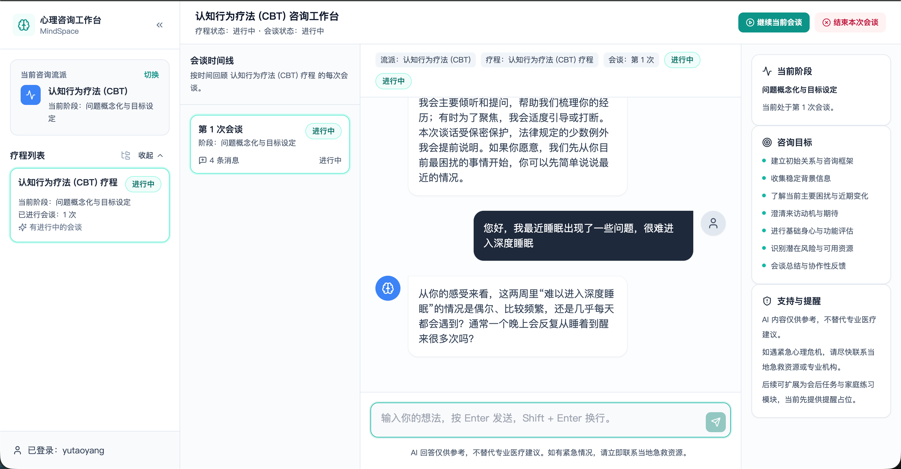

# PsychAgent

**PsychAgent: An Experience-Driven Lifelong Learning Agent for Self-Evolving Psychological Counselor**

<p align="center">
  <a href="https://github.com/ECNU-ICALK/PsychAgent"></a>
  <a href="https://arxiv.org/abs/2604.00931"></a>
  <a href="https://github.com/ECNU-ICALK/PsychAgent"></a>
  <a href="https://huggingface.co/ecnu-icalk/PsychAgent-Qwen3-32B"></a>
</p>

Documentation: [README.md](README.md)

PsychAgent is a research codebase for multi-session AI psychological counseling. It focuses on longitudinal interaction: carrying memory across sessions, retrieving explicit skills during counseling, and using reward-guided rollouts to select stronger trajectories.

Paper: [PDF](paper/PsychAgent.pdf) | [arXiv 2604.00931](https://arxiv.org/abs/2604.00931)  
Model: [ecnu-icalk/PsychAgent-Qwen3-32B](https://huggingface.co/ecnu-icalk/PsychAgent-Qwen3-32B)

<p align="center">
  
</p>

## Overview

This repository is the public research release of PsychAgent. It includes runnable pipelines for:

- multi-session dialogue generation
- evaluation on counselor-side and client-side metrics
- reward-driven best-of-n rollout selection
- prompts, configs, paper assets, and minimal example data

The current release is enough to run the public generation, evaluation, and RFT workflows. Full paper-scale training assets and the complete post-session skill evolution pipeline are not included in this snapshot.

## How PsychAgent Works

PsychAgent is organized around three practical components:

- **Memory and planning** keep cross-session continuity so later sessions build on earlier ones instead of restarting from scratch.
- **Skill retrieval** surfaces explicit counseling skills during interaction.
- **Reward-guided rollouts** generate multiple candidate trajectories and keep the better ones for downstream selection and internalization.

In the codebase, these ideas map to:

- [`src/sample/`](src/sample/) for multi-session generation
- [`src/eval/`](src/eval/) for evaluation and reward-related metrics
- [`src/rft/`](src/rft/) for best-of-n rollout and reward selection

## Multi-Agent Decision & Clinical Safety Architecture

In addition to baseline single-agent generation, PsychAgent implements a clinical-grade **11-Agent Multi-Agent Pipeline** (`src/sample/agents/`) that explicitly handles diagnostic uncertainty, crisis risk, proactive clarification, and supervisory safety guardrails:

```text
USER UTTERANCE
      │
      ▼
1. Memory / Context Agent ──► Retrieves longitudinal history, past homework, and therapy goals
      │
      ▼
2. State Assessment Agent ──► Assesses client affective, cognitive, and somatic state
      │
      ▼
3. Uncertainty Agent + 4. Risk / Safety Agent  (Parallel Epistemic & Harm Screening)
      │
      ▼
7. Orchestrator / Router Agent
      ├───────────────────────┬────────────────────────┐
      ▼                       ▼                        ▼
[CONFIDENT & SAFE]      [UNCERTAIN]             [SAFETY-CRITICAL]
      │                       │                        │
      │              5. Clarification Agent            │
      │                       │                        │
      │              6. Reassessment Agent             │
      │                       │                        │
      ▼                       ▼                        ▼
8. Counseling Agent ◄─────────┘                        │
   (Skill Retrieval + PsychAgent Core)                 │
      │                                                │
      └───────────────────────┬────────────────────────┘
                              ▼
                   9. Safety Supervisor Agent
           (De-escalation Guardrail & Crisis Resource Interceptor)
                              │
                              ▼
                     COUNSELOR RESPONSE
                              │
                              ▼
                   10. Outcome / Feedback Agent
             (Turn-level engagement & therapeutic alliance)
                              │
                              ▼
                   11. Memory Update Agent
         (Episodic storage, homework logging, goal revision)
```

### The 11 Specialized Agents:
1. **Memory / Context Agent** (`memory_agent.py`): Reconstructs longitudinal client trajectory from profile and session history.
2. **State Assessment Agent** (`state_agent.py`): Evaluates current emotional state, primary complaints, and cognitive distortions.
3. **Uncertainty Agent** (`uncertainty_agent.py`): Identifies missing clinical facts, ambiguity, and diagnostic confidence.
4. **Risk / Safety Agent** (`risk_agent.py`): Triages self-harm, suicidal ideation, abuse, and crisis indicators (None, Low, Moderate, Severe).
5. **Clarification Agent** (`clarification_agent.py`): Formulates targeted, empathetic clarifying questions when ambiguity impedes treatment.
6. **Reassessment Agent** (`reassessment_agent.py`): Integrates client clarifications, updates state, and resolves or persists uncertainty.
7. **Orchestrator Agent** (`orchestrator.py`): Routes flow dynamically between standard therapy, clarification, or crisis escalation.
8. **Counseling Agent** (`counseling_agent.py`): Couples multi-agent diagnostics with PsychAgent skill retrieval and therapeutic school framing.
9. **Safety Supervisor Agent** (`safety_supervisor.py`): Independent safety check verifying crisis protocol adherence and resource provision.
10. **Outcome / Feedback Agent** (`outcome_agent.py`): Assesses client progress, alliance shifts, and resistance across turns.
11. **Memory Update Agent** (`memory_update_agent.py`): Persists session recaps, homework adherence, and diagnostic updates.

## Repository Layout

The most important directories are:

- [`paper/`](paper/): paper PDF and figure assets used in the README
- [`configs/`](configs/): baseline, dataset, eval, runtime, and multi-agent configuration files
- [`assets/profiles/`](assets/profiles/): bundled profile assets used by `sample` and `rft`
- [`data/benchmark/`](data/benchmark/): structured multi-agent benchmark cases (ordinary, uncertain, safety-critical)
- [`data/eval/`](data/eval/): native evaluation examples
- [`data/eval_outputs_multi_agent/`](data/eval_outputs_multi_agent/): comparative evaluation results across 12 systems and ablations
- [`prompts/`](prompts/): system prompts, agent prompt templates, and evaluation criteria
- [`src/sample/agents/`](src/sample/agents/): the 11-agent multi-agent pipeline and orchestrator
- [`src/sample/`](src/sample/): multi-session generation runner and simulator
- [`src/eval/methods/multi_agent/`](src/eval/methods/multi_agent/): Layer-2 metrics (routing accuracy, uncertainty resolution, safety adherence)
- [`src/experiments/`](src/experiments/): benchmark execution and automated failure analysis
- [`src/eval/`](src/eval/): evaluation orchestration and clinical metric implementations
- [`src/rft/`](src/rft/): rollout generation and reward-based selection
- [`src/web/`](src/web/): full-stack web workspace for interactive counseling sessions
- [`src/shared/`](src/shared/): shared YAML and file utilities
- [`tests/`](tests/): comprehensive pytest test suite covering all agents, pipeline, and evaluation methods

If you are new to the repository, start with:

- [`src/README.md`](src/README.md) for the main code entry points
- [`configs/README.md`](configs/README.md) for configuration responsibilities

## Setup

PsychAgent does not ship with a pinned environment file yet. The following setup is a good starting point for the current public release:

```bash
python -m venv .venv
source .venv/bin/activate
pip install --upgrade pip
pip install openai httpx jinja2 pydantic PyYAML aiolimiter tenacity pytest
```

- Python **3.10+** is recommended.
- Install `torch` only if you need embedding-based skill library loading or backfilling.
- The bundled configs point to internal OpenAI-compatible endpoints. Replace them with your own service settings before running.
- The released checkpoint is available on Hugging Face: [ecnu-icalk/PsychAgent-Qwen3-32B](https://huggingface.co/ecnu-icalk/PsychAgent-Qwen3-32B).

## Required Environment Variables

The default examples rely on a few environment variables:

- `SGLANG_API_KEY`: counselor backend key used by the sample and RFT examples
- `API_KEY`: client simulator key for `sample`, or client/reward key for `rft`
- `CHAT_API_KEY`: fallback key used by `eval`, and optionally by reward evaluation
- `CHAT_API_BASE`: base URL used by `eval` when it is not set in config or CLI
- `CHAT_MODEL_NAME`: optional eval model override
- `PSYCHAGENT_EMBEDDING_API_KEY`: required by the current skill retrieval setup

## Quick Start

### 1. Run multi-session generation

```bash
export SGLANG_API_KEY=your_key_here
export API_KEY=your_client_simulator_key_here

python -m src.sample \
  --mode psychagent \
  --baseline configs/baselines/psychagent_sglang_local.yaml \
  --runtime configs/runtime/psychagent_sglang_local.yaml \
  --dataset configs/datasets/profiles_sample.yaml \
  --strict-config
```

Outputs are written to:

```text
sample_outputs/before_rft/<modality>/<case_id>/
```

Each case directory typically contains `course.json` and `session_*.json`.

### 2. Run evaluation

To evaluate the built-in eval examples:

```bash
export CHAT_API_KEY=your_eval_key_here
export CHAT_API_BASE=https://your-openai-compatible-endpoint/v1

python -m src.eval \
  --config configs/runtime/eval_default.yaml \
  --input-format auto \
  --modalities bt,cbt,het,pdt,pmt
```

To evaluate outputs generated by `sample`:

```bash
python -m src.eval \
  --config configs/runtime/eval_default.yaml \
  --input-format sample \
  --data-root sample_outputs/before_rft \
  --output-root data/eval_outputs_from_sample \
  --modalities cbt
```

### 3. Run reward-driven best-of-n rollouts

```bash
export SGLANG_API_KEY=your_key_here
export API_KEY=your_client_or_reward_key_here

python -m src.rft \
  --baseline configs/baselines/psychagent_sglang_local.yaml \
  --runtime configs/runtime/psychagent_sglang_local.yaml \
  --dataset configs/datasets/psycheval_bt_cbt_het_pdt_pmt.yaml \
  --rft-config configs/runtime/rft_default.yaml \
  --save_dir rft_outputs \
  --strict-config
```

To run `rft` on the bundled profile assets, switch `--dataset` to [`configs/datasets/profiles_rft.yaml`](configs/datasets/profiles_rft.yaml).

### 4. Try the Web workspace

If you want to experience the multi-session counseling flow in a browser, use the Web workspace under [`src/web/`](src/web/). For the full usage guide, see [`src/web/README.md`](src/web/README.md).

The recommended startup order is:

1. deploy the counselor model service
2. start the web backend
3. start the frontend

You can launch the counselor model service with `sglang` like this:

```bash
nohup python -m sglang.launch_server \
    --model-path /path/to/psychagent-checkpoint \
    --trust-remote-code \
    --port 30000 \
    --tp 8 \
    --host 0.0.0.0 \
    > /path/to/logs/sglang_server.log 2>&1 &
```

Update `base_url` in [`configs/baselines/psychagent_sglang_local.yaml`](configs/baselines/psychagent_sglang_local.yaml) so it matches your model service endpoint.

Then create a minimal `.env.local` in the project root:

```bash
SGLANG_API_KEY=your-sglang-key
PSYCHAGENT_EMBEDDING_API_KEY=your-embedding-key
BACKEND_PORT=8000
FRONTEND_PORT=5173
BACKEND_HOST=localhost
```

From the project root, start:

```bash
./run_backend.sh
./run_frontend.sh
```

Default endpoints:

```text
Frontend: http://localhost:5173
Backend:  http://localhost:8000
Health:   http://localhost:8000/health
```

Typical usage flow:

1. sign in or register
2. choose a counseling school
3. create a course
4. start the session
5. close the current session and continue to the next

Example UI screenshots:

#### Create Course



#### Switch School



#### Consultation View



## Configuration Guide

The three main workflows use different config combinations:

- `sample`: `baseline + runtime + dataset`
- `eval`: `runtime`
- `rft`: `baseline + runtime + dataset + rft-config`

Use [`configs/README.md`](configs/README.md) when you need field-level detail, such as:

- where to change model endpoints and API keys
- how to change output language, concurrency, or resume behavior
- how to switch datasets, splits, and modality coverage
- how to configure reward endpoints and rollout counts

## Included Data and Resources

This repository already includes:

- an initialization skill library under [`assets/skills/sect/`](assets/skills/sect/)
- bundled profile assets under [`assets/profiles/`](assets/profiles/)
- native evaluation examples under [`data/eval/`](data/eval/)
- prompts for `bt`, `cbt`, `het`, `pdt`, and `pmt`
- evaluation prompts and method implementations for shared and therapy-specific metrics
- paper assets under [`paper/`](paper/)
- the released checkpoint on Hugging Face

This release does not include:

- the full `PsychEval` training and evaluation assets used in the paper
- the complete post-session skill extraction and evolution pipeline
- a full end-to-end post-training recipe for reinforced internalization
- a repository license file

## Results Snapshot

The paper evaluates PsychAgent on the multi-session, multi-therapy `PsychEval` benchmark.

- `PsychAgent` (Qwen3-32B) reports `7.32 / 7.91 / 5.92 / 8.24` on counselor-shared, counselor-specific, client-shared, and client-specific metrics.
- Against `Qwen3-Max`, the reported gains are `+1.44 / +0.17 / +0.51 / +0.43`.
- Against `TheraMind`, the reported gains are `+1.07 / +0.97 / +0.44 / +0.41`.
- Across 522 matched dialogues, PsychAgent is ranked first by both human raters and the Gemini-3 LLM rater; human-human QWK is `0.675`.

Related paper assets include [`paper/radar_v1.pdf`](paper/radar_v1.pdf), [`paper/trend.pdf`](paper/trend.pdf), and [`paper/fig_11_qwk_heatmap_abc.png`](paper/fig_11_qwk_heatmap_abc.png).

## Multi-Agent Benchmark & Ablation Studies

The repository includes a curated multi-agent benchmark (`data/benchmark/`) testing 12 system configurations across 5 therapeutic modalities (`bt`, `cbt`, `het`, `pdt`, `pmt`):

- **System A**: Baseline Standard Single-Agent Counselor
- **System B**: Memory + Assessment Augmented
- **System C**: Dynamic Routing (Uncertainty + Risk + Safety)
- **System D**: Full Multi-Agent Pipeline (No Clarification)
- **System E**: Full Multi-Agent Pipeline (Standard Clarification)
- **System F**: Full Adaptive Multi-Agent Pipeline (Dynamic Clarification & Longitudinal Memory)
- **Ablation Studies**:
  - `No_Uncertainty`: Bypasses epistemic uncertainty quantification
  - `No_Risk`: Disables explicit clinical harm triage
  - `No_Clarification`: Suppresses interactive questioning
  - `No_Supervisor`: Removes supervisory safety guardrails
  - `No_Memory`: Restricts context to zero-shot / single session
  - `No_Routing`: Collapses dynamic routing into uniform therapy path

### Running the Systems & Failure Analysis:

```bash
# Run comparative evaluation across all 12 systems
python src/experiments/run_systems.py

# Generate granular diagnostic failure analysis
python src/experiments/failure_analysis.py
```

Failure analysis outputs are stored in [`data/eval_outputs_multi_agent/failure_analysis.json`](data/eval_outputs_multi_agent/failure_analysis.json) and summarized in [`data/eval_outputs_multi_agent/REPORT_SUMMARY.md`](data/eval_outputs_multi_agent/REPORT_SUMMARY.md).

## Testing & Verification

Run the comprehensive pytest suite covering all 11 individual agents, the composite pipeline, and clinical evaluation methods:

```bash
# Run all tests
pytest tests/

# Run agent unit tests
pytest tests/agents/

# Run multi-agent and psychometric evaluation tests
pytest tests/eval/
```

## Project Status

PsychAgent should currently be read as a research code release rather than a polished production package. The repository already provides runnable public workflows for generation, evaluation, and best-of-n reward selection. A few items are still best treated as follow-up work for a broader public release:

- a repository license
- a pinned environment file
- public-ready service templates in the example configs
- fuller reproduction notes for paper-scale experiments
- more explicit deployment guidance for the released checkpoint

## Citation

Paper page: [arXiv:2604.00931](https://arxiv.org/abs/2604.00931)

```bibtex
@misc{yang2026psychagent,
  title         = {PsychAgent: An Experience-Driven Lifelong Learning Agent for Self-Evolving Psychological Counselor},
  author        = {Yutao Yang and Junsong Li and Qianjun Pan and Jie Zhou and Kai Chen and Qin Chen and Jingyuan Zhao and Ningning Zhou and Xin Li and Liang He},
  year          = {2026},
  eprint        = {2604.00931},
  archiveprefix = {arXiv},
  primaryclass  = {cs.AI},
  url           = {https://arxiv.org/abs/2604.00931},
  doi           = {10.48550/arXiv.2604.00931}
}
```

## Safety Notice

- This repository is for **research and experimental use only**.
- It is **not** a substitute for licensed mental-health professionals, medical diagnosis, emergency response, or crisis intervention.
- Real-world deployment would require additional work on safety, privacy, informed consent, monitoring, escalation, and clinical governance.
- If someone may be at immediate risk of harm, contact local emergency or crisis-support services rather than relying on an automated system.

## Acknowledgements

- [`PsychEval`](configs/datasets/psycheval_bt_cbt_het_pdt_pmt.yaml) for the benchmark setting and evaluation protocol adopted in the paper
- OpenAI-compatible API tooling, Jinja2 templating, and Pydantic-based validation used throughout the released code
