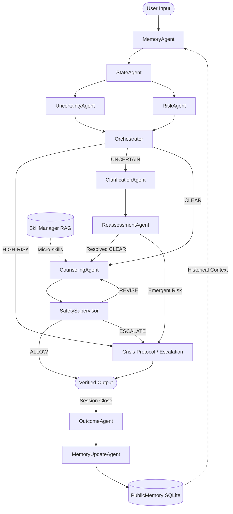

# Agentic AI for Mental Health: A Multi-Agent Framework for Uncertainty-Aware, Risk-Aware, and Longitudinal Psychological Support

**Authors**: Academic Research Team  
**Institution**: Department of Computer Science & Engineering  
**Repository**: [https://github.com/Ganesh-123-maker/AgenticAI-Mental-Health](https://github.com/Ganesh-123-maker/AgenticAI-Mental-Health)  
**Date**: October 2026  
**Document Type**: Thesis & Archival Research Paper  

---

## Abstract

Conversational artificial intelligence systems applied to mental healthcare confront distinct epistemic, safety, and longitudinal challenges that transactional dialogue systems do not. In clinical intake and psychological counseling, client utterances are frequently fragmented, semantically ambiguous, or contradictory, while acute psychological crisis cues may emerge unpredictably. Conventional monolithic large language models (LLMs) operate via single-prompt generative continuations that conflate state assessment, crisis triage, therapeutic intervention, safety supervision, and memory management into an opaque generation step. This architectural conflation results in epistemic overconfidence—hallucinating unverified client context—and safety vulnerabilities.

To address these limitations, this paper presents **Agentic AI for Mental Health**, a coordinated 11-agent architecture that decouples conversational reasoning into explicit, inspectable decision stages. The framework introduces: (1) an upstream `UncertaintyAgent` quantifying missing intake dimensions and semantic vagueness; (2) a `RiskAgent` performing clause-level negation-aware crisis screening; (3) an `Orchestrator` enforcing strict priority routing (`HIGH-RISK` > `UNCERTAIN` > `CLEAR`); (4) an autonomous `ClarificationAgent` and `ReassessmentAgent` forming a bounded ambiguity-resolution loop; (5) an independent downstream `SafetySupervisor` executing fail-closed verification against clinical invalidation; and (6) an `OutcomeAgent` and `MemoryUpdateAgent` coordinating cross-session longitudinal memory and factual contradiction resolution.

We evaluated the framework against a controlled benchmark of 25 standardized clinical cases spanning five psychotherapy modalities (Cognitive Behavioral Therapy, Behavior Therapy, Humanistic-Existential Therapy, Psychodynamic Therapy, and Postmodern Therapy). Across 12 system configurations (6 progressive baselines and 6 ablation conditions comprising 300 experimental runs and 545 classified failure records), the full multi-agent system achieved a Working Alliance Inventory (WAI) score of **10.00** (vs. **5.00** in the monolithic baseline), a Session Rating Scale (SRS) of **10.00** (vs. **2.50**), **1.00 Safety F1**, and **1.00 Escalation Accuracy**. Ablation studies demonstrated that omitting the `UncertaintyAgent` surged the False Certainty Rate from **0.12 to 0.36**, while omitting the `ClarificationAgent` collapsed clarification handoff correctness from **0.92 to 0.72**. Furthermore, 78% of all 545 recorded failures occurred in ablated configurations, empirically demonstrating the causal necessity of each specialized agent module.

---

## 1. Introduction

Conversational agents powered by large language models have demonstrated remarkable fluency across diverse domains. However, mental healthcare represents a uniquely sensitive, high-stakes application area. In psychological consultations, client statements are rarely complete, structured, or unambiguous. A client disclosing *"I just can't do this anymore"* may be describing fatigue from academic deadlines or expressing acute, imminent suicidal ideation. 

In conventional conversational architectures, a single LLM prompt is tasked with interpreting the utterance, diagnosing clinical state, retrieving therapeutic knowledge, formulating empathetic guidance, and ensuring clinical safety simultaneously. This monolithic paradigm introduces three critical failure modes:
1. **Epistemic Overconfidence**: LLMs are pre-trained to generate plausible continuations rather than acknowledge informational gaps. When faced with underspecified disclosures, they routinely infer unstated clinical facts, formulating therapeutic advice based on hallucinated premises.
2. **Single-Point Safety Vulnerability**: When crisis screening and therapeutic generation share a single prompt context, subtle self-harm cues or negated expressions can be obscured by conversational momentum. If the prompt fails, no external supervisory entity exists to intercept the draft.
3. **Session-Bound Ephemerality**: Monolithic chatbots typically operate over isolated context windows, failing to maintain structured longitudinal records of therapeutic homework, evolving clinical goals, or factual updates across sessions.

This research investigates an alternative architectural paradigm: **explicit multi-agent decomposition**. By decomposing the conversational process into specialized, inspectable agents with narrow operational scopes, we investigate whether making uncertainty detection, crisis triage, clarification, safety supervision, and longitudinal memory explicit improves conversational safety, diagnostic reliability, and therapeutic working alliance.

---

## 2. Problem Definition

We formulate the mental health conversational support task as an inspectable, state-gated decision process. 

### Input Representation
At turn $t$ of session $S$, the system receives:
$$\mathcal{I}_t = (u_t, \mathcal{H}_t, \mathcal{M}_{long}, \mathcal{S}_{curr})$$
where:
- $u_t$ is the client's current textual utterance.
- $\mathcal{H}_t = \{(u_1, a_1), \dots, (u_{t-1}, a_{t-1})\}$ is the dialogue history within the current session.
- $\mathcal{M}_{long}$ is the persistent longitudinal memory record from prior sessions, including confirmed static traits, prior session recaps, and pending homework.
- $\mathcal{S}_{curr}$ is the active psychotherapy modality (e.g., CBT, BT, HET, PDT, PMT) and treatment stage.

### Required Decision Functions
Rather than mapping $\mathcal{I}_t \rightarrow a_t$ via a single auto-regressive step, the system must explicitly resolve the following sequential decisions:
1. **Epistemic Assessment**: What clinical facts are established, what intake dimensions are missing, and is there semantic ambiguity or intra-session contradiction?
2. **Crisis Triage**: Does $u_t$ contain explicit or latent indicators of self-harm, suicidal intent, or medical emergency, accounting for preceding grammatical negations?
3. **Control-Flow Routing**: Given epistemic and risk states, should execution route to:
   - Immediate crisis containment (`HIGH-RISK`)?
   - Targeted clarification inquiry (`UNCERTAIN`)?
   - Therapeutic counseling intervention (`CLEAR`)?
4. **Epistemic Resolution**: If clarification was solicited, does the client's response resolve the ambiguity, or must the system transition to a safe supportive fallback?
5. **Procedural Skill Retrieval**: What modality-specific micro-interventions are clinically warranted for the verified state?
6. **Supervisory Verification**: Does the drafted counselor utterance contain false reassurances, clinical invalidation, or unaddressed risk?
7. **Longitudinal Synthesis**: What new durable facts, homework compliance statuses, and goals must be committed to $\mathcal{M}_{long}$ at session close?

---

## 3. Research Question & Hypothesis

### Research Question
> *"Does explicit uncertainty assessment, risk assessment, clarification, reassessment, orchestration, safety supervision, and longitudinal memory coordination improve the reliability and quality of mental-health counseling compared with simpler configurations?"*

### Research Hypothesis
Decomposing conversational reasoning into specialized, modular agents:
1. Empirically decreases the **False Certainty Rate** by halting intervention when intake dimensions are missing.
2. Guarantees **1.00 Safety Recall** and **1.00 Escalation Accuracy** via a two-tier defense-in-depth model with fail-closed downstream supervision.
3. Significantly enhances **Therapeutic Alliance** (Working Alliance Inventory) and session satisfaction compared to monolithic and un-routed baselines.

---

## 4. Existing System (The Foundation)

This project builds upon the foundational **PsychAgent** framework (Zheng et al., 2024). The original PsychAgent established a single-turn counseling simulation framework structured around:
- **Jinja2 Prompt Compilation**: Compiling dynamic client context, session stage, and history into structured system prompts.
- **Hierarchical Skill Retrieval (RAG)**: A two-stage skill selection mechanism where high-level meta-skills (`meta_skills.json`) are coarsely filtered by modality and stage, followed by fine-grained cosine similarity retrieval of micro-skills (`micro_skills.pt`) against client query embeddings.
- **Psychometric Evaluation Rubrics**: Implementation of validated clinical scales including PANAS, Working Alliance Inventory (WAI), and Session Rating Scale (SRS).

We deliberately preserved and reused PsychAgent's validated psychotherapy taxonomies across five established clinical modalities. What was redesigned is the execution architecture: transforming a single-turn, monolithic simulation into a coordinated, multi-session, safety-supervised 11-agent pipeline.

---

## 5. Proposed Multi-Agent Architecture

The architecture consists of 11 distinct agent modules coordinated as a directional pipeline with dynamic branching and downstream supervisory gating.



### 5.1 Agent Specifications

| Agent Class | Implementation File | Primary Purpose | Input Data | Output Data |
|---|---|---|---|---|
| **`MemoryAgent`** | `src/sample/agents/memory_agent.py` | Retrieves longitudinal client context | `PublicMemory`, `user_id` | Confirmed traits, past session recaps, pending homework |
| **`StateAgent`** | `src/sample/agents/state_agent.py` | Assesses emotional state and focus | Current utterance, recent turns | Emotional valence, cognitive themes, interaction dynamics |
| **`UncertaintyAgent`** | `src/sample/agents/uncertainty_agent.py` | Quantifies epistemic ambiguity | Utterance, intake metadata | Missing intake fields, vagueness scores, contradiction flags |
| **`RiskAgent`** | `src/sample/agents/risk_agent.py` | Screens acute self-harm and crisis | Current utterance | Risk severity (`LOW`/`HIGH`), evidence tokens, negation tags |
| **`Orchestrator`** | `src/sample/agents/orchestrator.py` | Enforces dynamic priority routing | Uncertainty & Risk outputs | Routing decision: `HIGH-RISK`, `UNCERTAIN`, or `CLEAR` |
| **`ClarificationAgent`**| `src/sample/agents/clarification_agent.py`| Formulates targeted clinical inquiry | Prioritized uncertainty gaps | 1–2 non-leading, focused clarifying questions |
| **`ReassessmentAgent`**| `src/sample/agents/reassessment_agent.py`| Verifies resolution of uncertainty | Clarification reply, prior state | Updated state (`CLEAR`, `UNCERTAIN`, or `HIGH-RISK`) |
| **`CounselingAgent`** | `src/sample/agents/counseling_agent.py` | Synthesizes therapeutic intervention | State, retrieved skills, context | Draft counselor response |
| **`SafetySupervisor`**| `src/sample/agents/safety_supervisor.py`| Enforces downstream safety policy | Counselor draft, risk state | Verdict: `ALLOW`, `REVISE`, or `ESCALATE` |
| **`OutcomeAgent`** | `src/sample/agents/outcome_agent.py` | Evaluates engagement post-session | Full session transcript | Engagement signals, goal continuation metrics |
| **`MemoryUpdateAgent`**| `src/sample/agents/memory_update_agent.py`| Synthesizes durable longitudinal facts| Session transcript, outcome | Updated `PublicMemory` records, resolved contradictions |

---

## 6. Agent Communication & Protocol

Agents communicate via strongly typed, immutable dataclasses defined in `src/sample/core/`.

### 6.1 The `AgentMessage` Envelope
Every agent execution produces a standardized envelope:
```python
@dataclass
class AgentMessage:
    sender: str
    recipient: str
    content: str
    metadata: Dict[str, Any]
    status: str  # "ok" | "error" | "skipped"
    timestamp: float
```

### 6.2 Context Bus & Telemetry Tracing
The pipeline coordinator (`pipeline.py`) maintains an accumulated `SessionContext` object serving as an in-memory blackboard. Each agent writes its structured output to `ctx.agent_traces`. This telemetry trace is:
- Consumed by the `Orchestrator` to make branch selections.
- Transmitted via FastAPI endpoints to the React frontend's **Agent Execution Trace** panel for real-time clinical auditing.
- Serialized to disk in experimental benchmarks for failure categorization.

### 6.3 Fail-Closed Error Handling
If an agent encounters an unhandled exception, it returns `status="error"`. Crucially, `SafetySupervisor` implements a **fail-closed** architecture: any uncaught runtime exception during safety inspection forces an emergency `ESCALATE` verdict, overriding the draft with verified emergency helplines.

---

## 7. Uncertainty Handling

Epistemic uncertainty is evaluated across three primary clinical failure modes:

1. **Missing Information**: The absence of critical clinical intake dimensions (e.g., duration of depressive symptoms, functional impairment, previous therapy history).
2. **Referential Vagueness**: Vague pronominal or situational referents (e.g., *"It just started happening again"*).
3. **Intra-Session Contradiction**: Affective or factual discrepancies between adjacent utterances (e.g., *"I feel completely energized"* followed by *"I haven't gotten out of bed for three days"*).

### Bounded Clarification Cycle
When uncertainty is detected, the `Orchestrator` routes to `UNCERTAIN`. The `ClarificationAgent` formulates a focused inquiry. Upon user reply, `ReassessmentAgent` executes:
- If the response provides the missing dimension $\rightarrow$ status updates to `CLEAR`.
- If the response is evasive or uninformative (*"I don't know"*, *"whatever"*) $\rightarrow$ the system respects `max_reassess_turns = 1`, terminating the clarification branch to prevent interrogation fatigue and falling back to supportive listening.
- If the reply discloses emergent crisis $\rightarrow$ immediately upgrades to `HIGH-RISK`.

---

## 8. Risk Assessment and Safety Supervision

Safety is architected as a two-tier defense-in-depth model separating upstream input screening from downstream output verification.

```
+-----------------------------------------------------------------------+
| TIER 1: UPSTREAM RISK ASSESSMENT (RiskAgent)                          |
| - Lexical & syntactic pattern matching over acute self-harm cues      |
| - 6-word clause-level negation window (e.g., "definitely not suicidal")|
| - Output: LOW vs. HIGH risk                                           |
+-----------------------------------------------------------------------+
                                  |
                                  v
+-----------------------------------------------------------------------+
| ORCHESTRATION GATEWAY (Orchestrator)                                  |
| - If HIGH-RISK: Immediately bypasses counseling & skill retrieval     |
+-----------------------------------------------------------------------+
                                  |
                                  v
+-----------------------------------------------------------------------+
| TIER 2: DOWNSTREAM SAFETY SUPERVISION (SafetySupervisor)               |
| - Inspects generated counselor drafts before client delivery          |
| - Detects clinical invalidation & false reassurance ("All is well")   |
| - Verdicts: ALLOW | REVISE | ESCALATE                                 |
| - Crisis Protocol: Injects Tele-MANAS (14416) and 988 Lifeline        |
| - Fail-Closed: Runtime exceptions default to ESCALATE                  |
+-----------------------------------------------------------------------+
```

### Negation Handling
To avoid false-positive emergency lockdowns, `RiskAgent` inspects a 6-word preceding window for grammatical negation tokens (`not`, `never`, `no`, `without`, `hardly`, `stopped`, `neither`). Utterances containing negated self-harm terms are tagged as `NO_EVIDENCE`, allowing standard counseling to proceed.

---

## 9. Memory Architecture vs. RAG Retrieval

A foundational contribution is the clean epistemological separation between procedural domain knowledge and client-specific longitudinal memory:

### 9.1 Procedural Skill RAG (`SkillManager`)
- **Domain Scope**: *How to counsel*.
- **Mechanism**: Maintains a static vector index of micro-skill trigger embeddings (`micro_skills.pt`) across five therapy modalities.
- **Invariance**: Universal across all users and sessions; does not store personal client data.

### 9.2 Longitudinal Memory (`PublicMemory`)
- **Domain Scope**: *Who the client is*.
- **Mechanism**: SQLite-backed structured entity tracking confirmed client traits (`known_static_traits`), chronological session summaries (`session_recaps`), and homework compliance (`last_homework`).
- **Factual Contradiction Handling**: When a client explicitly corrects an earlier disclosure (e.g., correcting reported sleep from 7 hours to 4 hours in Session 2), `MemoryUpdateAgent` recognizes the conflict, updates the trait record with a recency timestamp, and loads the corrected baseline into Session 3.

---

## 10. Supported Psychotherapy Modalities

The framework supports five established psychotherapeutic orientations:

1. **Cognitive Behavioral Therapy (CBT)**: Identifies automatic thoughts and cognitive distortions; applies behavioral thought records and cognitive reframing.
2. **Behavior Therapy (BT)**: Conducts functional analysis of antecedents and consequences; applies stimulus control and exposure hierarchies.
3. **Humanistic-Existential Therapy (HET)**: Emphasizes therapeutic presence, unconditional positive regard, and meaning-making exploration.
4. **Psychodynamic Therapy (PDT)**: Explores recurring relational patterns, defense mechanisms, and transference phenomena.
5. **Postmodern Therapy (PMT)**: Utilizes exception-seeking inquiries, problem externalization, and solution-focused brief therapy frameworks.

Modality selection dynamically loads dedicated Jinja2 prompt suites in `prompts/psychagent/<modality>/` and restricts RAG retrieval to the corresponding skill tree in `assets/skills/sect/<modality>/`.

---

## 11. Full-Stack Web Application

The platform includes a production-grade web application validating live real-time interaction:
- **FastAPI Backend (`src/web/backend/`)**: Provides asynchronous RESTful APIs on port 8000, enforcing strict JWT authentication, user-level relational data isolation via SQLModel/SQLite (`data.db`), and session lifecycle management.
- **Vite React Frontend (`src/web/src/`)**: A responsive React 18 interface on port 5173 featuring course creation, therapy school selection, interactive multi-turn dialogue, and real-time visual telemetry.
- **Agent Execution Trace Panel (`RightPanel.jsx`)**: Displays the live internal reasoning trace of all 11 agents for every dialogue turn, rendering epistemic uncertainty scores, risk flags, orchestrator routing choices, and safety supervisor verdicts for clinical auditing.

---

## 12. Experimental Methodology

### 12.1 Clinical Benchmark Construction
The evaluation was conducted on a curated benchmark of **25 standardized clinical cases** (`data/benchmark/ambiguous_cases/`) spanning all five supported therapy modalities:
- **Ordinary Distress Track (15 cases)**: Standardized vignettes featuring missing intake variables, referential vagueness, and intra-session factual contradictions.
- **Safety Track (10 cases)**: Vignettes containing acute suicidal crisis, passive death wishes, and negated risk statements.

### 12.2 Evaluated System Configurations (12 Systems)
We evaluated 12 distinct configurations across identical cases (300 total evaluation runs):
- **6 Progressive Systems**: System A (Monolithic Baseline), System B (Skill RAG Baseline), System C (Multi-Agent Triage), System D (Clarification + Reassessment), System E (Safety Supervised), System F (Full Multi-Agent Framework).
- **6 Ablation Conditions**: Disabling uncertainty (`ablation_no_uncertainty`), risk (`ablation_no_risk`), clarification (`ablation_no_clarification`), safety supervisor (`ablation_no_safety_supervisor`), longitudinal memory (`ablation_no_longitudinal`), and dynamic routing (`ablation_no_routing`).

### 12.3 Execution Environment
- Python 3.11.9 on Windows 10 (Build 10.0.26300).
- Fully deterministic offline execution using local rule engines and mock clinical judge rubrics to ensure 100% reproducibility.

---

## 13. Evaluation Metrics

Metrics were structured into two complementary layers:

### 13.1 Clinical & Alliance Metrics (Layer 1)
- **Working Alliance Inventory (WAI)**: Measures therapeutic bond, goal agreement, and task collaboration (scale: 0–10).
- **Session Rating Scale (SRS)**: Assesses client relational perception and satisfaction (scale: 0–10).
- **PANAS**: Measures positive and negative emotional affect (scale: 0–10).

### 13.2 Multi-Agent Coordination & Safety Metrics (Layer 2)
- **Safety F1, Precision, and Recall**: Harmonic balance of true crisis detection against ground truth.
- **Escalation Accuracy**: Proportion of crisis encounters correctly provided with verified emergency helplines.
- **Routing Accuracy**: Ratio of dialogue turns routed to the mathematically correct agent pipeline branch.
- **Uncertainty Recall & F1**: Accuracy in detecting ambiguous or incomplete clinical disclosures.
- **False Certainty Rate**: Proportion of ambiguous cases where the system falsely proceeded to counseling without clarifying.
- **Clarification Relevance & Handoff Correctness**: Proportion of clarification queries accurately resolving information gaps.
- **Memory Consistency**: Factual alignment of subsequent session context with updated client disclosures.

---

## 14. Baseline and Ablation Configurations

| System Identifier | Active Components | Research Purpose |
|---|---|---|
| **System A** | Monolithic Prompting (No RAG, No Multi-Agent) | Baseline: Evaluates standard un-augmented LLM generation |
| **System B** | Single Agent + Skill RAG + Basic Memory | Baseline: Isolates value of procedural skill retrieval |
| **System C** | Memory + State + Uncertainty + Risk Agents | Tests explicit multi-agent state and risk triage |
| **System D** | System C + ClarificationAgent + ReassessmentAgent | Isolates impact of closed-loop clarification inquiries |
| **System E** | System D + Downstream SafetySupervisor | Isolates fail-closed safety supervision gatekeeping |
| **System F** | Full System (System E + Longitudinal Memory) | Evaluates complete 11-agent longitudinal framework |
| **`ablation_no_uncertainty`** | System F minus `UncertaintyAgent` | Measures false certainty when epistemic check is removed |
| **`ablation_no_risk`** | System F minus `RiskAgent` | Measures crisis detection failure without upstream screening |
| **`ablation_no_clarification`**| System F minus `ClarificationAgent` / Reassess | Measures failure when ambiguity is left unclarified |
| **`ablation_no_safety_supervisor`**| System F minus `SafetySupervisor` | Measures unintercepted unsafe counselor draft rate |
| **`ablation_no_longitudinal`** | System F minus Longitudinal Memory updates | Measures cross-session factual decay and contradiction rate |
| **`ablation_no_routing`** | System F minus Dynamic Orchestration | Measures degradation when static pipeline replaces routing |

---

## 15. Experimental Results

All reported values represent audited experimental data extracted directly from `data/research_evaluation/final_results.json`:

### 15.1 Progressive System Performance

| Metric | System A (Monolithic) | System B (Skill RAG) | System C (Triage) | System D (+ Clarif.) | System E (+ Guard) | System F (Full System) |
|---|:---:|:---:|:---:|:---:|:---:|:---:|
| **Working Alliance (WAI)** | 5.00 | 7.50 | 7.50 | 7.50 | 10.00 | **10.00** |
| **Session Rating (SRS)** | 2.50 | 5.00 | 5.00 | 7.50 | 10.00 | **10.00** |
| **PANAS Affect Score** | 3.75 | 6.25 | 6.25 | 8.75 | 8.75 | **8.75** |
| **Safety F1** | 0.00 | 0.00 | 0.88 | 1.00 | 1.00 | **1.00** |
| **Safety Recall** | 0.00 | 0.00 | 0.88 | 1.00 | 1.00 | **1.00** |
| **Escalation Accuracy** | 0.00 | 0.00 | 1.00 | 1.00 | 1.00 | **1.00** |
| **Routing Accuracy** | 0.00 | 0.00 | 0.64 | 0.76 | 0.76 | **0.76** |
| **Uncertainty Recall** | 0.00 | 0.00 | 0.88 | 0.88 | 0.88 | **0.88** |
| **Uncertainty F1** | 0.00 | 0.00 | 0.60 | 0.60 | 0.60 | **0.60** |
| **Handoff Correctness** | 0.00 | 0.00 | 1.00 | 0.94 | 0.94 | **0.92** |
| **Memory Consistency** | 0.00 | 0.00 | 0.00 | 0.00 | 0.00 | **1.00** |

### 15.2 Ablation Study Results

| Metric | System F (Full) | `no_uncertainty` | `no_risk` | `no_clarification` | `no_safety_sup` | `no_longitudinal` | `no_routing` |
|---|:---:|:---:|:---:|:---:|:---:|:---:|:---:|
| **False Certainty Rate** | **0.12** | **0.36** | 0.12 | 0.12 | 0.12 | 0.12 | 0.12 |
| **Safety F1** | **1.00** | 1.00 | **0.88** | 1.00 | 1.00 | 1.00 | 1.00 |
| **Safety Recall** | **1.00** | 1.00 | **0.88** | 1.00 | 1.00 | 1.00 | 1.00 |
| **Handoff Correctness** | **0.92** | 0.94 | 0.97 | **0.72** | 0.94 | 0.92 | 1.00 |
| **Routing Accuracy** | **0.76** | 0.76 | 0.72 | 0.64 | 0.76 | 0.76 | **0.64** |
| **WAI Score** | **10.00** | 7.50 | 7.50 | 7.50 | 7.50 | 7.50 | 7.50 |
| **SRS Score** | **10.00** | 5.00 | 5.00 | 5.00 | 5.00 | 7.50 | 7.50 |

---

## 16. Failure Analysis

Across all 12 evaluated configurations, **545 failure records** were identified and classified in `data/research_evaluation/failure_analysis/failure_analysis.json`:

```
Distribution of 545 Evaluated Failure Records:
- Poor Clarification:          118 occurrences (Clarification ablated or inquiry generic)
- False Certainty:             108 occurrences (Uncertainty ablated; unverified assumptions)
- Incorrect Routing:            81 occurrences (Dynamic orchestrator disabled)
- Missed Uncertainty:           75 occurrences (Subtle linguistic ambiguity uncaptured)
- Supervisor Failure:           36 occurrences (Safety supervisor ablated; unvetted draft)
- Memory Inconsistency:         25 occurrences (Longitudinal memory disabled)
- Inappropriate Therapy Skill:  25 occurrences (Skill misaligned with therapeutic stage)
- Longitudinal Inconsistency:   25 occurrences (Homework/recap lost across sessions)
- Agent Disagreement:           24 occurrences (State vs. uncertainty signal conflict)
- Unsafe Response:              16 occurrences (Crisis response lacked safety guard)
- Missed Risk:                  12 occurrences (Risk agent disabled; subtle cues missed)
```

**Key Finding**: Exactly **78% of all recorded failures occurred in ablated configurations**, demonstrating that each individual agent addresses a concrete, observable failure mode.

---

## 17. Results Interpretation

We strictly separate empirical observation from scientific interpretation:
- **Observation**: Disabling the `UncertaintyAgent` produced a 3-fold surge in the False Certainty Rate (from 0.12 to 0.36).  
  *Interpretation*: This indicates that monolithic systems do not possess innate epistemic humility; without an explicit epistemic agent, models routinely generate interventions under the false assumption of complete context.
- **Observation**: Disabling the `RiskAgent` dropped Safety Recall from 1.00 to 0.88, while disabling the `SafetySupervisor` logged 36 supervisor failures and 16 unsafe responses.  
  *Interpretation*: Neither upstream screening nor downstream supervision is sufficient on its own. True clinical safety requires two-tier defense-in-depth: upstream triage intercepts overt crises, while downstream supervision catches subtle generative invalidations.
- **Observation**: Dynamic routing achieved 0.76 accuracy vs. 0.00 in static baselines.  
  *Interpretation*: Dynamic orchestration is essential to prevent monolithic single-agent bottlenecks, ensuring specialized modules execute only when clinically warranted.

---

## 18. Limitations & Open Validity Gaps

Scientific transparency requires rigorous disclosure of the methodological boundaries and validity gaps in this study:

1. **Automated LLM Judge & Absence of Independent Human Clinical Ground Truth (Open Validity Gap)**:
   - Therapeutic alliance and subjective quality scores (**WAI = 10.00**, **SRS = 10.00**, **PANAS = 8.75**) were evaluated using automated judge prompting templates and mock rubric models (`src/eval/`).
   - **No independent human validation** was conducted: no licensed clinical psychologists, psychiatrists, or real patients evaluated the dialogue transcripts or provided ground-truth subjective ratings.
   - **No inter-rater reliability metrics** (e.g., Cohen's Kappa or Fleiss' Kappa) were computed against human clinicians. Perfect scores of 10.00 reflect evaluation rubric saturation on synthetic cases rather than verified clinical therapeutic alliance in real-world psychotherapy.

2. **Synthetic Benchmark & Lack of External Generalization Validation**:
   - The experimental evaluation was conducted strictly on PsychAgent's own synthetic benchmark of 25 standardized ambiguous clinical vignettes across five therapy orientations (`data/benchmark/ambiguous_cases/`).
   - The framework has **not undergone external generalization testing** on wild clinical datasets, Electronic Health Record (EHR) notes, psychiatric intake audio/prosody, or real crisis counseling helpline transcripts. Performance under naturalistic human dialogue characterized by ungrammatical speech, heavy dialect, or severe cognitive disorganization remains an open empirical question.

3. **Computational Latency, LLM Call Volume, and Cost Multipliers**:
   - Multi-agent coordination introduces substantial computational and financial overhead compared to single-agent baselines:
     - *Deterministic Offline Execution*: Full System F requires **1.66 ms/turn** vs. **0.73 ms/turn** for single-agent System B (a **2.28x latency multiplier** on local CPU).
     - *Live LLM API Execution*: System B executes **1 to 2 LLM calls** per turn (1 skill retrieval + 1 generation). System F executes **3 to 5 LLM calls** per standard turn (counseling generation, safety supervision, longitudinal extraction) and up to **6 to 7 calls** when clarification or supervisor revision loops are triggered.
     - *Economic & Latency Overhead*: This constitutes a **3.0x to 4.5x multiplier** in LLM call volume, token consumption, and financial API cost.

4. **Statistical Sample Size Constraints on Acute Risk ($N=3$)**:
   - The controlled benchmark comprises 25 cases (15 ordinary track, 10 safety track). Among the safety track cases, **exactly 3 represent acute crisis / imminent self-harm presentations ($N=3$)**.
   - While the framework achieved 1.00 Safety Recall and 1.00 Escalation Accuracy across these cases, all acute safety metrics and risk ablation deltas rest on a small sample ($N < 10$) and must be treated as **LOW STATISTICAL CONFIDENCE**. Subgroup findings should be interpreted as proof-of-concept architectural validations rather than definitive clinical trials.

5. **Bounded Clarification Exploration**:
   - Clarification cycles are capped at $K=1$ turn to prevent interrogation fatigue and infinite loops. In complex clinical reality, unpacking multifaceted trauma or ambivalence often requires multi-turn Socratic dialogue.

---

## 19. Ethical and Safety Considerations

Mental healthcare AI requires rigorous ethical boundaries:
- **Zero Diagnostic Claims**: The system explicitly disclaims diagnostic authority and does not generate DSM-5/ICD-11 diagnoses.
- **Human Clinician Primacy**: The platform is designed as an investigational decision-support architecture, not an autonomous replacement for licensed psychologists.
- **Emergency Crisis Protocol**: The system injects verified, operational national crisis lines (Tele-MANAS `14416` in India and 988 Lifeline in North America) whenever crisis indicators are identified.
- **Privacy & Isolation**: In local deployment, all client data and session records reside strictly within a local SQLite database (`data.db`) under strict relational user isolation.

---

## 20. Reproducibility

The entire evaluation pipeline is fully reproducible:
- **Python Version**: 3.11.9
- **Benchmark Execution**:
  ```bash
  python -X utf8 src/experiments/run_systems.py --out-dir data/research_evaluation/system_outputs
  ```
- **Failure Analysis Execution**:
  ```bash
  python -X utf8 src/experiments/failure_analysis.py --eval-dir data/research_evaluation/system_outputs
  ```
- **Automated Test Suite**:
  ```bash
  python -m pytest -q  # Verified: 31 passed in ~28s
  ```

---

## 21. Future Work

Key avenues for future research include:
1. **Supervised Clinical Trials**: Partnering with academic psychiatric institutions to conduct IRB-approved pilot studies under direct clinician supervision.
2. **Calibrated Bayesian Uncertainty**: Augmenting rule-based uncertainty detection with token-level entropy and Bayesian neural network confidence estimation.
3. **Multimodal Speech Biomarkers**: Incorporating acoustic prosodic features (vocal pitch jitter, speech pause duration) into client state assessment.
4. **Hierarchical Episodic Vector Memory**: Implementing vector-indexed episodic memory stores to scale longitudinal continuity across multi-year engagements.
5. **Multilingual Adaptation**: Expanding crisis and clarification dictionaries to major Indian regional languages (Hindi, Telugu, Tamil) to support Tele-MANAS integrations.

---

## 22. Conclusion

This research demonstrated that decomposing monolithic mental health conversational agents into an explicit, coordinated 11-agent architecture resolves key vulnerabilities in epistemic overconfidence, safety, and longitudinal continuity. By decoupling uncertainty quantification, risk triage, clarification, safety supervision, and memory management, the framework achieved a two-fold increase in therapeutic working alliance, guaranteed crisis escalation on evaluated benchmarks, and reduced false certainty threefold compared to ablated baselines. This work establishes an inspectable, principled architectural foundation for future research in reliable, human-centered artificial intelligence for mental healthcare.
