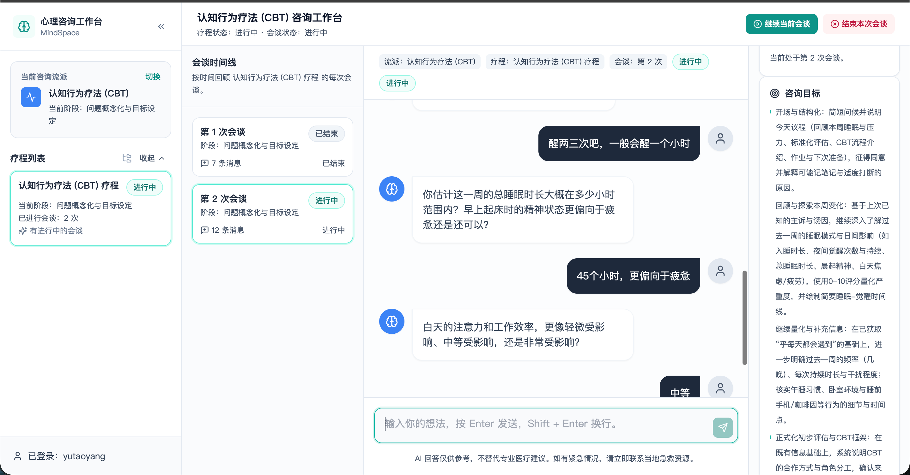

# PsychAgent Web

PsychAgent Web is a browser-based workspace for experiencing and interacting with the multi-session counseling flow of PsychAgent.

It provides a modern user-facing frontend and a local backend suited for demonstrations, interactive evaluation, and lightweight development.

## Features

- User authentication: Sign up and sign in
- Modality selection: Create counseling courses by therapeutic school (CBT, PDT, HET, etc.)
- Session initialization: Auto-start initial intake sessions
- Multi-turn interaction: Real-time dialogue during counseling sessions
- Multi-session continuity: Close active sessions and transition to follow-up sessions
- Full-course completion: Conclude entire multi-session counseling courses

## Screenshots

### Create Course


### Switch School


### Consultation View


### Follow-up Session


## Deploy Counselor Model

To deploy the counselor model service before connecting the Web workspace, launch an `sglang` server:

```bash
nohup python -m sglang.launch_server \
    --model-path /path/to/psychagent-checkpoint \
    --trust-remote-code \
    --port 30000 \
    --tp 8 \
    --host 0.0.0.0 \
    > /path/to/logs/sglang_server.log 2>&1 &
```

Update `base_url` in [`../../configs/baselines/psychagent_sglang_local.yaml`](../../configs/baselines/psychagent_sglang_local.yaml) to match your deployed model endpoint.

## Quick Start

Launch directly from the repository root:

```bash
cd PsychAgent
```

### 1. Prepare Environment Variables (`.env.local`)

Create `.env.local` in the project root:

```bash
SGLANG_API_KEY=your-sglang-key
PSYCHAGENT_EMBEDDING_API_KEY=your-embedding-key
BACKEND_PORT=8000
FRONTEND_PORT=5173
BACKEND_HOST=localhost
```

### 2. Start Backend

```bash
./run_backend.sh
```

### 3. Start Frontend

In a separate terminal window:

```bash
./run_frontend.sh
```

Default access endpoints:

```text
Frontend: http://localhost:5173
Backend:  http://localhost:8000
Health:   http://localhost:8000/health
```

## Manual Setup

To run services manually inside `src/web`:

### 1. Enter Directory

```bash
cd src/web
```

### 2. Install Frontend Dependencies

```bash
npm install
```

### 3. Prepare Python Environment

```bash
python3 -m venv .venv
source .venv/bin/activate
python3 -m pip install --upgrade pip
python3 -m pip install -r requirements.txt
```

### 4. Configure Environment Variables

```bash
export SGLANG_API_KEY="your-sglang-key"
export PSYCHAGENT_EMBEDDING_API_KEY="your-embedding-key"
```

To override configuration defaults:

```bash
export PSYCHAGENT_WEB_BASELINE_CONFIG="configs/baselines/psychagent_sglang_local.yaml"
export PSYCHAGENT_WEB_RUNTIME_CONFIG="configs/runtime/psychagent_sglang_local.yaml"
```

### 5. Start Backend

```bash
uvicorn main:app --reload --host 0.0.0.0 --port 8000
```

### 6. Start Frontend

In a separate terminal window:

```bash
npm run dev
```

## Usage Workflow

1. Open the web interface and sign in.
2. Select a counseling modality/school.
3. Create a new therapeutic course.
4. Interact with the counselor in the session dialogue view.
5. Conclude the current session to trigger memory consolidation and progress to subsequent sessions.
6. Complete the full course once therapeutic goals have been achieved.

## Configuration

### Frontend

The frontend defaults to connecting to:

```text
http://localhost:8000
```

To configure a custom backend endpoint:

```bash
VITE_API_BASE=http://127.0.0.1:8001 npm run dev
```

### Backend

Key environment variables:

- `PSYCHAGENT_WEB_BASELINE_CONFIG`
- `PSYCHAGENT_WEB_RUNTIME_CONFIG`
- `DB_URL`
- `SGLANG_API_KEY`
- `PSYCHAGENT_EMBEDDING_API_KEY`

The default SQLite database is saved as `data.db`.

## Production Build

Compile production assets:

```bash
npm run build
```

Preview production build:

```bash
npm run preview
```

Artifacts are output to:

```text
dist/
```

## System Requirements

- Node.js 18+
- npm
- Python 3.10+
- Deployed model service endpoint
- Required API or embedding service credentials

## Troubleshooting

### Page loads but requests fail
Check whether the backend is running on port 8000 and verify that `VITE_API_BASE` points to the correct backend host.

### Backend fails on startup with missing key
Ensure `SGLANG_API_KEY` and `PSYCHAGENT_EMBEDDING_API_KEY` are exported in your environment or set in `.env.local`.

### Native dependency build issues on `npm install`
Run:

```bash
npm install --include=optional
```

## Directory Structure

- `src/`: React frontend application
- `backend/`: FastAPI Web service and persistence
- `main.py`: Backend application entry point
- `requirements.txt`: Python package requirements
- `package.json`: Frontend npm scripts and dependencies

## Related Documentation

- [Project README](../../README.md)
- [Source Code Guide](../README.md)
